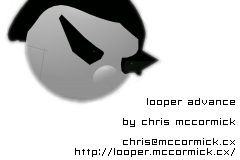
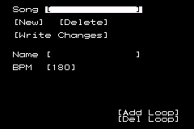
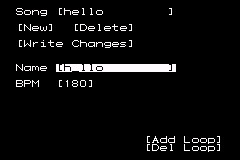
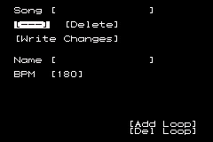
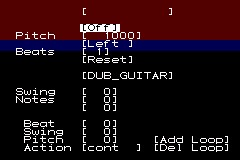
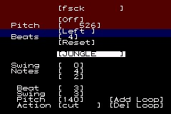

Loop based music composition and live performance tool for Gameboy Advance.

# MIDI out #

LooperAdvance can now send a "Song Position Pointer" (0xF2) synchronisation signal over MIDI. See the [MIDI readme](./midi/README.md) for more information.

# Tutorial #

turn on the gameboy advance or run the rom in your emulator of choice. press the A button to skip past the splash screens. because this is your first time running the rom, there are no saved songs in memory. you will be presented with a blank song screen like this:

things between square brackets [] are user modifiable parameters. these include select boxes, buttons, number boxes, and edit boxes. to move between editable boxes on the screen, use the navigation keypad.

to perform an operation with a box simply hold down the A button and move the keypad buttons. this will do different things depending on what type of box is selected.

to practice, move down to the box next to ‘Name’. once this box is highlighted, you will see a flashing cursor. hold down the A button and press the up button on the keypad. you will see the letter ‘a’ appear. now, still holding down the A button, press the right button on the keypad. still holding the A button, press the up key twice. you will see the letter ‘b’ appear. in this way you can write the name of your song into the edit box. there is no facility to delete a letter yet (!)

from top to bottom the function of the various buttons is as follows:

the top most button is a select box. when you have more than one song you can use this select box to change between saved songs.

below this is the new button. clicking this button (holding down the A button and pressing up or right) will create a new song in memory.

to the right of this button is the delete button. clicking this button will delete the currently selected song from memory.

the next button below is the write changes button. be careful with this button – it writes all changes to all songs in memory into permanent save ram. this means that any modifications that you have made to any songs since your last save will be written permanently. use this button after you have created new songs, changed a song, or deleted songs and you want to permanently remember the changes (for later performance for example).

below this is the song name edit box as we have seen already. use this to edit the currently selected song.

next down is the beats per minute box. hold down the A key and press left/right to modify the BPM by values of 1. if you hold down the A key and press the up or down buttons the value will change by larger increments. this is true of most number boxes.

now that we have set up our basic song parameters (beats per minute and song name) you may want to click the write changes button and save your song.

next we need to add loops to this song. each loop appears on a separate ‘page’. to navigate between pages use the left and right shoulder buttons on the gameboy advance. to add a loop go down to the add loop button. click the add loop button to add a loop. to go to your new loop press the right shoulder button. you can go back to the songs page by pressing the left shoulder button. the screen will now show a blank loop like this:

clicking the delete loop button on any page will delete the loop immediately to the right of the current loop.

songs in looper advance are composed of several loops made up of bits of samples. the various parameters determine what the loop will sound like and how the sample, or parts of it will be played back. the following is a description of each box you can edit on the loop page and what it does:

the top most box is an edit box. use this to give your loop a unique name. this makes it easy to recognise which loop you are playing when playing live.

next down is the on/off button. use this to turn off the audio output of a particular loop. if you turn this on now you will hear the funny noise of an unconfigured loop.

below this is the pitch box. modifying it’s value will change the pitch at which the sample is played back. you can use this to fine-tune samples to eachother or external audio. as usual with number boxes, pressing left and right will modify the value by 1, whilst pressing up and down will modify it in greater increments.

the next box below this is the panning button. samples can currently be panned directly to the left or right. looper advance is set up this way so that in live situations samples can be run into jack 1 or jack 2 of a mixing desk.

the next box is the beats button. modifying this button tells the loop how many pieces to divide this loop into. use this to split a sample up into smaller chunks which can be re-sequenced, played back at different pitches, etc. for example you might like to split a drum loop such as BLOCROCK into 16 parts. you can then use each little piece of the beat to build a completely new beat. melodic samples such as SINEWAVE sound best in general if you leave them as 1 piece (though of course breaking ‘rules’ such as this often makes for more interesting music). short percussive samples generally work well if you split them into 2. most percussive samples have trailing silence so that the 2nd part will be silent and allow for cutting the note at it’s end.

the next box down is the reset button. use this button to reset the pitch of a sample to stretch it to cover an entire bar at the current beats per minute. for example if you have a sample that is 2 seconds long, and the BPM of the song results in a bar that is 2.5 seconds long, pressing reset will slow the playback speed of the sample down to fit within the 2.5 second bar exactly.

next is the sample select box. this changes which sample to use in the current loop. the samples you can use are hard coded into the rom. if you wish to use your own samples you’ll have to compile a new rom from the source code.

below this is the swing box. use this to swing every second beat out by a few milliseconds. each number in the box corresponds to 1/60th of a second swing.

now we come to the per-note editing functions. above this you have the tools to make reasonable sounding generic loops that go together. from here down you can customise each note of a loop and create truly unique sounds.

the box next to the word ‘Notes’ tells this loop how many notes long it should be. when playing the loop will go through each note and loop over once it’s past the last one. so for example if you have a loop that is 8 notes next to a loop that is 7 notes you can get some quite interesting polyrhythms.

the box below this is for selecting which note you are currently editing. this goes from zero (the first note) to the number of notes you have minus one (the last note).

the box next to the word ‘Beat’ dictates which part of the loop is going to be played at this position in the loop. so for example if you have the number 16 selected in the beats box above, and this box contains the number 3, then the 3rd chunk out of 16 chunks will be played when the loop reaches this note in it’s sequence. selecting 0 in this box plays no part of the beat at all – effectively a musical ‘rest note’.

the swing box below allows you to dictate how far to swing each note past it’s default position. this allows for more humanistic beats and other groove effects, by shifting parts of the beat into slightly different times from where they would normally fall.

next is the pitch box. these pitches fine tune a particular chunk of the loop to be played at a pitch relative to the current loop’s default. you can create melodies by using one of the short melodic samples with a beats division of 1 or 2 and a bunch of notes played a different relative pitches.

the last button is the action button. this determines what happens when the end of a note is reached. let’s say you have a beat split up into 16 parts with the beats parameter above. you’re playing part 3 of this beat which happens to be a snare drum sound. you play the snare drum sound at 140 – one octave above the current pitch for this loop. if ‘cut’ is selected in the action box the sound will stop as soon as the end of the snare drum chunk is reached. if ‘cont’ is selected in the action box, the rest of the loop will continue to play (so for example if the next chunk contains a bassdrum sound, the bassdrum sound will spill backinto this note and part of it will be heard, depending on the pitch at which it’s played). this allows for some interesting swing-type effects. if ‘loop’ is selected the sound will jump back to the beginning of the snare drum segment and play it as many times as will fit into this note. selecting ‘feed’ does something a bit different. if you have 0 selected in the ‘beat’ box, the sound will continue from the previous note unchanged. this allows you to play longer sounds that stretch over several notes. the ‘stretch’ action is meant to time stretch the note, but currently just plays the note repeatedly 60 times a second making a funny (and possibly annoying) buzzing sound.

Looper Advance is currently under active development so some of the ways in which it works may change from time to time.

here's an example of a configured loop:

# License #

Copyright Chris McCormick 2003 - 2014. [GPLv3](./copying.txt) license.
