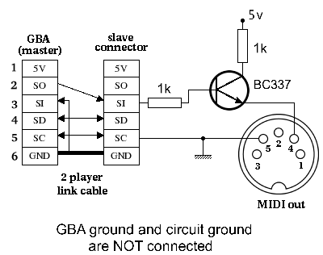

MIDI support
------------

Sends "Song Position Pointer" message (0xF2) so you can sync external midi hardware to it.

You will need to build your own hardware to support this feature but it is not a very complicated circuit:

All of tech knowledge for doing MIDI out came from [Avelino Herrera Morales'](http://gba.atlantes.org/index_en.html) excellent page of projects and schematics. Thanks for sharing, Avelino!

### Official Gameboy Micro link cable "Pinout" ###

Info from [here](https://www.cheapassgamer.com/topic/55995-gamecube-to-game-boy-micro-cable-instructions-in-here/?p=10843691) if you want to build the MIDI out using the official Gameboy Micro cable from Nintendo.

	blue = pin 1 (Power)
	red = pin 2 (Serial Out)
	orange = pin 3 (Serial In)
	brown = pin 4 (Serial Data)
	green = pin 5 (Serial Clock)
	Ground = pin 6

## MIDI technical information ##

<http://www.personal.kent.edu/~sbirch/Music_Production/MP-II/MIDI/midi_physical_layer.htm#note2>

